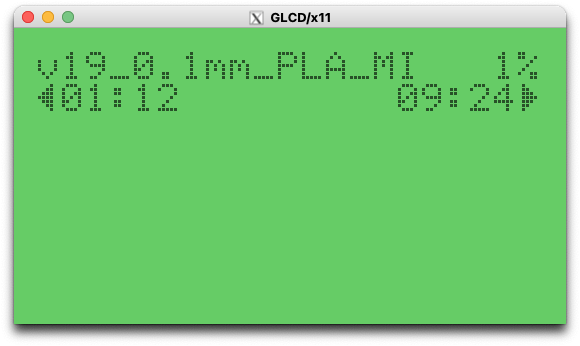
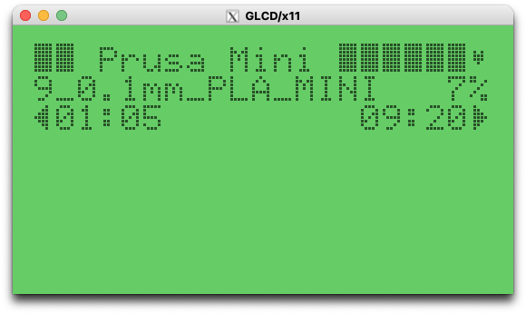
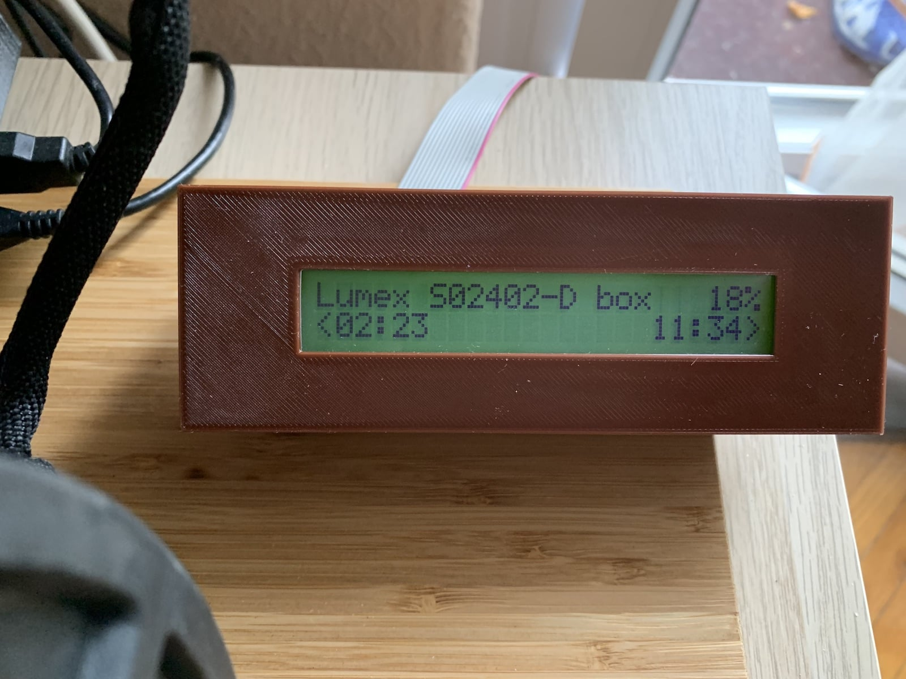
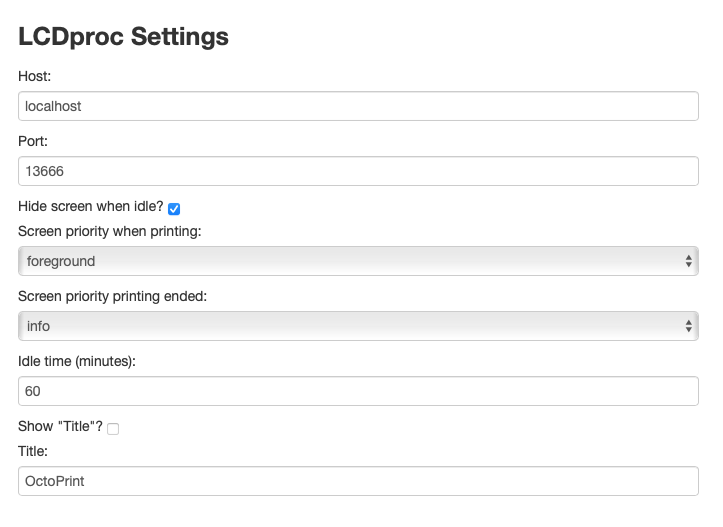

# OctoPrint-LCDproc

## About

This plugin will enable support for the [LCDd/LCDproc](http://lcdproc.omnipotent.net) supported displays.

- [ChangeLog](CHANGELOG.md)
- [Issue Tracker](https://github.com/czo/octoprint-lcdproc/issues/)

## Screenshots

|
:--:|:--:
|

## Setup

Install manually using this URL ([Plugin Manager](https://docs.octoprint.org/en/master/bundledplugins/pluginmanager.html) will be available later):

    https://github.com/czo/octoprint-lcdproc/archive/refs/tags/0.1.2.zip

or for the current, development version:

    https://github.com/czo/octoprint-lcdproc/archive/refs/heads/main.zip
    

## Configuration

**TODO:** Describe your plugin's configuration options (if any).
